# LATAM fleet — 3D replicas

Blender models of LATAM Airlines aircraft, built to one standard: **the
dimensions have to match the manufacturer's document, and the paint has to match
a photograph of that specific registration**. The bar is not "it looks like an
airliner" — it is a LATAM engineer recognising their own aircraft.

**The whole LATAM passenger fleet — nine types — plus both halves of the cargo
fleet.** Eleven aircraft, each gated against photographs of its own
registration, each shown from the three angles that answer the three questions:
the shape, the proportions and paint along the hull, and the tail — where this
project spent most of its measurement.

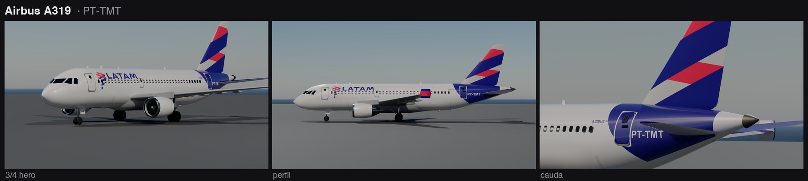

**Airbus A319 (ceo)** · PT-TMT · 33.84 m · [`A319_LATAM.blend`](airbus%20A319/A319_LATAM.blend)


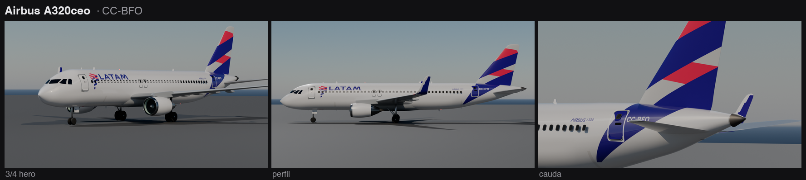

**Airbus A320ceo** · CC-BFO · 37.57 m · [`A320ceo_LATAM.blend`](airbus%20A320ceo/A320ceo_LATAM.blend)


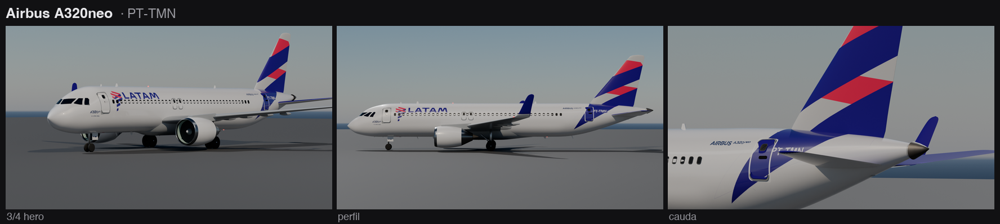

**Airbus A320neo** · PT-TMN · 37.57 m · [`A320neo_LATAM.blend`](airbus%20A320neo/A320neo_LATAM.blend)


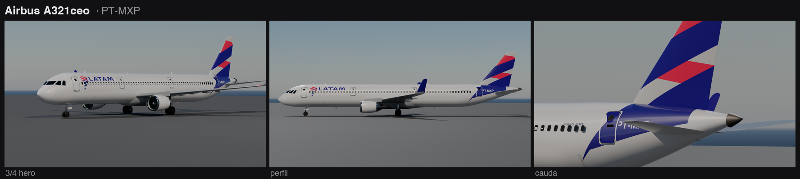

**Airbus A321-231 (ceo)** · PT-MXP · 44.51 m · [`A321ceo_LATAM.blend`](airbus%20A321ceo/A321ceo_LATAM.blend)


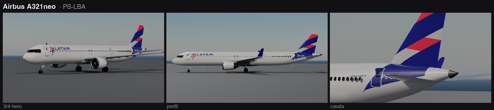

**Airbus A321neo (ACF)** · PS-LBA · 44.51 m · [`A321neo_LATAM.blend`](airbus%20A321neo/A321neo_LATAM.blend)


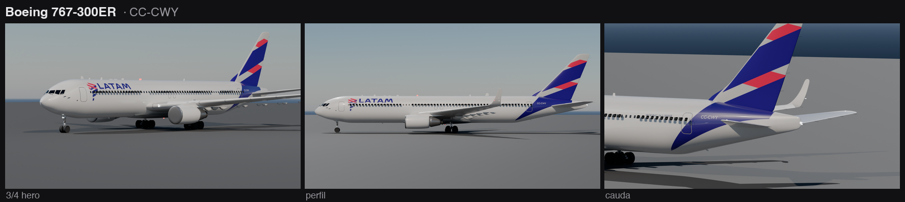

**Boeing 767-300ER** · CC-CWY · 54.94 m · [`B763_LATAM.blend`](boeing%20767-300ER/B763_LATAM.blend)


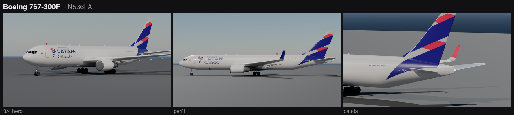

**Boeing 767-300F** · N536LA · 54.94 m · *LATAM Cargo Colombia, factory freighter* · [`B763F_LATAM_CARGO.blend`](boeing%20767-300F/B763F_LATAM_CARGO.blend)


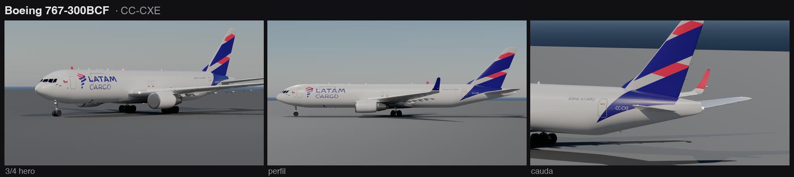

**Boeing 767-300BCF** · CC-CXE · 54.94 m · *LATAM Cargo Chile, converted* · [`B763BCF_LATAM_CARGO.blend`](boeing%20767-300BCF/B763BCF_LATAM_CARGO.blend)


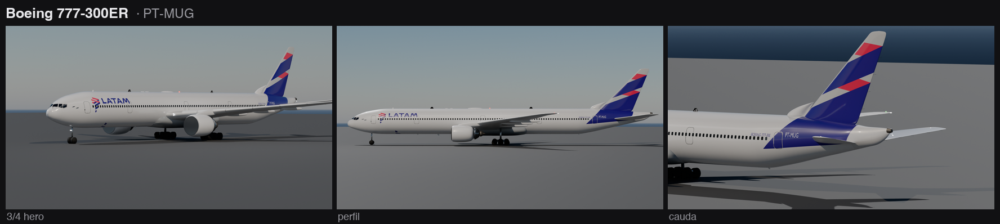

**Boeing 777-300ER** · PT-MUG · 73.86 m · [`B77W_LATAM.blend`](boeing%20777-300ER/B77W_LATAM.blend)


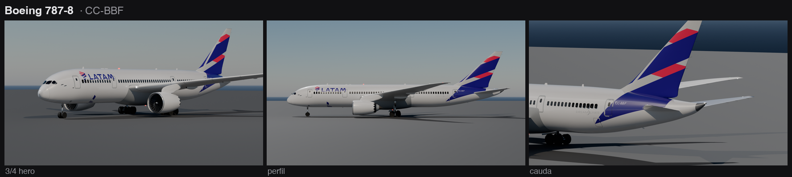

**Boeing 787-8 Dreamliner** · CC-BBF · 56.72 m · [`B788_LATAM.blend`](boeing%20787-8/B788_LATAM.blend)


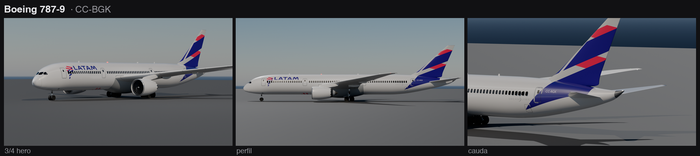

**Boeing 787-9 Dreamliner** · CC-BGK · 62.81 m · [`B789_LATAM.blend`](boeing%20787-9/B789_LATAM.blend)

Together they cover all 356 passenger aircraft LATAM operates — the A320ceo
alone accounts for 135 of them — and the two freighters cover the 19-aircraft
cargo fleet in both of its halves — 7 built as freighters, 12 converted. LATAM Cargo is not the passenger livery repainted: the hull is
white to the belly, the rear wedge is smaller, the lockup runs LATAM over
CARGO, the winglets are indigo outboard and coral inboard, and the belly
carries the symbol alone. Only the fin sash passes through unchanged.


*A320neo departing 17R at Santiago — 240 frames, 9.6 s. The camera flies
formation in the aircraft's own coordinate frame from the first frame to the
last, opening 130 m off the nose with the jet at 42% of the frame — titles,
nose and gear legible — through the rotation, then craning up and away so
the terminals, the LATAM base and the cordillera open around it. The move is
measured rather than eyeballed — see [§8 of the scenery
manual](scenario/README.md).*

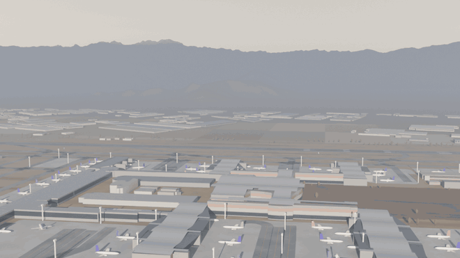

*The second clip: a northbound aerial survey of the whole airport — it
opens on the T1/T2 terminal core with its piers and parked fleet, crosses
the control tower, and closes on the LATAM base — where one of
every type in this repository is parked — both runways crossing the frame
end to end
([`scenario/base_flyover.py`](scenario/base_flyover.py)).*

*The version history is kept in the repository: every `a320_scl_v*.gif` is
one improvement round over the one before — ground weathering, buildings,
the base detail, margin scrub, farmland, runway furniture, and two camera
rebuilds. Earlier clips for comparison: the
[first SCL camera](airbus%20A320neo/a320_scl.gif),
a [no-scenery pass](airbus%20A320neo/a320_decolagem_v2.gif) and an
[orbit-in-place clip](airbus%20A320neo/a320_voo.gif).*

---

### São Carlos — the second base

**SDSC / Aeroporto Estadual Mário Pereira Lopes**, Água Vermelha, São Carlos/SP:
LATAM's heavy-maintenance base — nine hangars, 22 workshops, ~2 000 people,
~270 aircraft a year, and **hangar 9**, opened 26 September 2025 for Boeing 787
heavy maintenance. Built in [`scenario_sdsc/`](scenario_sdsc/) and linked the
same way Santiago is. Three clips, and none of them is Santiago with the labels
changed — this field is short, it is not level, and its base sits 35 m below its
runway.

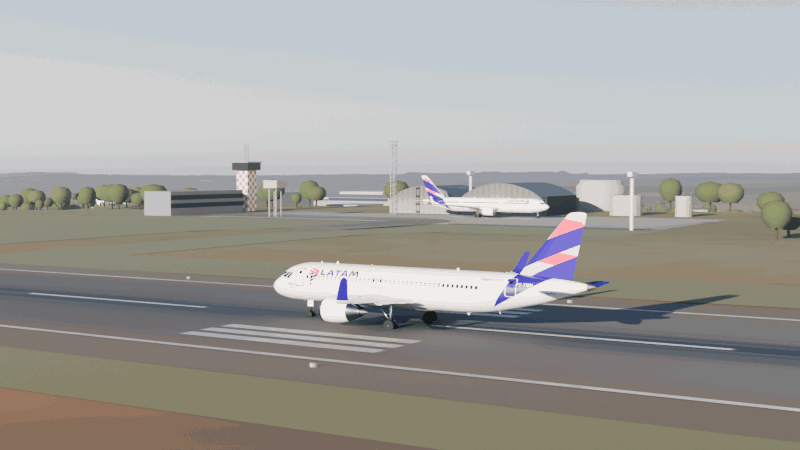

*A320neo lifting off **RWY 02** — 240 frames, 9.6 s. TORA here is 1 672 m and
anything leaving is a ferry flight, so it goes early: the wheels leave at
1 150 m with 522 m of runway still ahead. The runway falls 0.62% and the wheels
ride it down. **The reveal is the terrain, not the camera:** the maintenance
base is 35 m below the runway and behind its crest, so at frame 1 the sight line
to the MRO apron misses by 5.5 m — you cannot see the base from the runway. It
breaks the crest at frame 78, nine frames after rotation, and by the close the
apron, the nose-in line and hangar 9 are all open behind the climbing jet.
([`scenario_sdsc/takeoff_camera.py`](scenario_sdsc/takeoff_camera.py))*

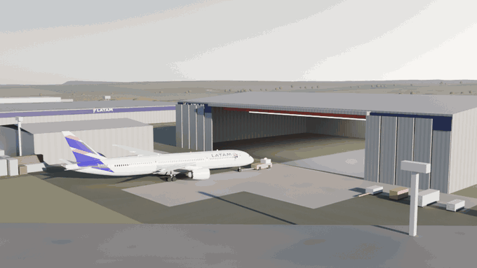

*A **787-9** towed into **hangar 9** — 400 frames, 16.0 s, and the clip nothing
in this repository had done before. The aeroplane is not a choice: the hangar was
built for 787 heavy maintenance and its 78 × 20.5 m door is sized off a 787-9's
60.1 m span. The tow is solved as a **tractrix run backwards** — the aeroplane's
heading is the control curve, the main gear integrates along it and the nose gear
is derived, so the tug's track and the nose-wheel steering fall out of the maths
and the aeroplane is guaranteed square to the door. The main gear cuts 3.65 m
inside the nose-gear line, the tail swings 5.01 m outside it, and at the last
frame the wingtips sit in the opening with 8.94 m to spare each side. It is
400 frames because a 787 does not enter a hangar in ten seconds.
([`scenario_sdsc/hangar_tow.py`](scenario_sdsc/hangar_tow.py))*


*The aerial tour — 240 frames, 9.6 s, one straight line at constant rate with a
travelling aim, the São Carlos answer to the Santiago survey above. It opens over
the Aeroclube and the runway, crosses the mid-field cluster with its
chequerboard tower, and settles on the MRO: the 471 m hangar line, the nose-in
row, and hangar 9 standing apart from everything OpenStreetMap traced in 2017.
**There is no horizon here** — the whole 360° band spans −0.35° to +1.33° — so
the anchor is not a shape but a level: a ruler-straight edge held at v 0.81 to
0.84 for all 240 frames.
([`scenario_sdsc/base_flyover.py`](scenario_sdsc/base_flyover.py))*

**The version trail tells the base's story.** `_v2` built the surround, `_v3`
put the real fleet on the ramp, and the departure's `_v4` re-shot the rotation
on the geometry-truth round's landing gear — the A320 rotates to its
photograph-checked tailstrike attitude now. The nine airliners on
the MRO stands and the widebody on the mid-field apron were low-poly proxies;
they are ten of the eleven real masters — the whole A320 family in three
lengths, a 767-300ER, a LATAM Cargo 767-300F on jacks, and the 787-9 on
hangar 9's stand. One module,
[`scenario_sdsc/fleet_placement.py`](scenario_sdsc/fleet_placement.py), places
them for all three clips: it *links* the masters' four sub-collections and puts a
collection-instance empty at each stand, so ten detailed aeroplanes cost the shot
files about 0.3 MB rather than 40, and Cycles syncs each type's geometry once
however many stands use it. It is a **heavy-check** base, so the states had to
survive the switch — `docked` and `jacked` come free, `engine_off` is an append
of `02_Motores` with the port side deleted, and the open fan cowls had to be
*built*, because no master has a cowl door to hinge. `scenario_sdsc/README.md`
§9 is the whole reckoning, including what it costs per frame.*

---

### Guarulhos — the hub, and the 777's home

**SBGR / Aeroporto Internacional de São Paulo/Guarulhos — Gov. André Franco
Montoro**: LATAM's hub, and the third base — the field the 777-300ER fleet
calls home, because the hangar where those aircraft are maintained stands at
its NE corner and the ADC chart prints HANGAR LATAM on the footprint. Built in
[`scenario_sbgr/`](scenario_sbgr/) and nothing here repeats the other two
bases: **two parallel runways** 373 m apart with the fleet holding between
them, a field that is level to six feet, a horizon that is a **ring** (+0.12°
to +3.23°, never negative, all of it real terrain), the **Cabuçu/Cantareira
wall** carrying closed-canopy Atlantic forest across every north-facing frame
— and a **metropolis of 1.3 million people wrapped around the fence**, which
after the surround round renders as what it is: 120 402 landuse-and-street
tint cells, 22 000 structures of which 7 743 are real OSM footprints, the
Cumbica warehouse belt, 1 303 km of minor streets, and 23 222 canopy crowns
on the serra ([`scenario_sbgr/README.md`](scenario_sbgr/README.md) §9.4).

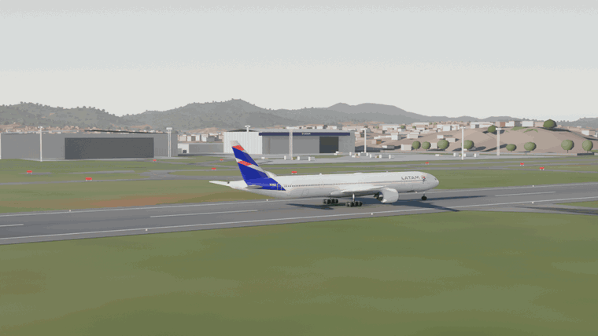

*The **777-300ER** off **RWY 10L** — 240 frames, 9.6 s, one orbit flown in
the aircraft's own frame from the aft-starboard quarter, no dolly, no
hand-over. The geometry in time is the shot: rotation begins **abeam the
LATAM hangar** at 2 571 m, so the nose lifts exactly as the aeroplane's own
maintenance base crosses the frame behind it, and the tilt is pinned to the
Cantareira crest at +2.39° the way Santiago pins the Andes — ridge above,
fabric below, both grazing-lit by the 17:30 sun dead astern of a 073°
departure.
([`scenario_sbgr/takeoff_camera.py`](scenario_sbgr/takeoff_camera.py))*

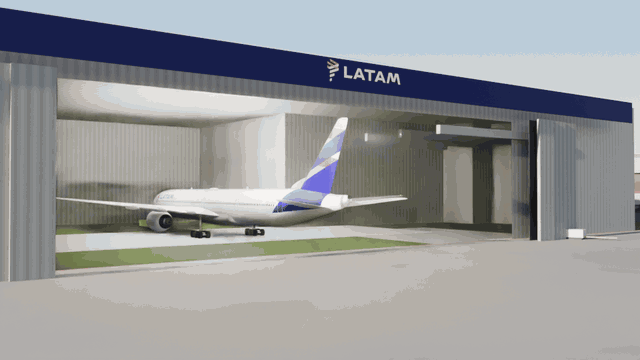

*The roll-out — 400 frames, 16 s, and the inversion of São Carlos's hangar
clip: there a 787 was towed **in** nose-first; here the 777 comes **out the
way an MRO actually releases one — tail first**, backing into the daylight.
The first thing to cross the door line is the FIN: the sash slides out of a
dark bay into raking light through the **76 m opening** of the 100 m door
(leaves stacked 12 m each end; 5.6 m per wingtip on a 64.8 m span, fin top
18.5 m under the 20.5 m lintel). Same tractrix mathematics as the São Carlos
tow — the entry is solved forward and played in reverse, so the tug never
changes ends and the aeroplane is square to the door by construction.
([`scenario_sbgr/hangar_rollout.py`](scenario_sbgr/hangar_rollout.py))*


*The aerial tour — 240 frames, 9.6 s, one straight line at literally constant
rate (the camera knots are ON the line; the first solve let PCHIP modulate
the speed to 478 m/s) with a travelling aim: the terminal crescent and tower,
both runways crossing the frame, the mid-field, and the close on the LATAM
corner — the hangar, its 777, the 901 widebody row — with Bonsucesso and the
forested serra behind. **The ring is never empty**: every beat holds city
fabric or forest past the fence, which is the point of the surround round
below. ([`scenario_sbgr/base_tour.py`](scenario_sbgr/base_tour.py))*

*The version trail here carries a confession. The tour is `_v2` (the
surround round); the departure is `_v3` and the roll-out `_v2` because their
predecessors shipped with the 777 sunk to its belly — the placement cited
"wheels at z 0" from the exported GLB, whose exporter seats every aircraft
on the floor by its own rule, and the owner caught in the published GIFs
what the pipeline's numeric checks never looked at. The gear datum is now
measured in the master itself (contact z −5.67), and the review rule that
came out of it is in the scenery manual: three frames of every GIF, by eye,
before it ships.

---

The A319 is a spec-level derivation of the A320neo master: same nose and
cross-section, the two constant-section plugs removed (1.60 m forward of the
wing, 2.13 m aft), tail translated 3.73 m forward, empennage repositioned per
the A319 ACAP, IAE V2500 nacelles, wingtip fences instead of sharklets, single
overwing exit, and the PT-TMT ecarpe/registration measured on CC0 photographs
(`airbus A319/spec_a319.json`, builders `build_a319_geo.py` +
`build_a319_livery.py`).

The A321neo is the opposite derivation from the same master: two
constant-section plugs added (+4.26 m forward of the wing — pinned by the ACAP
gear and engine stations, 5.07 + 16.90 = 21.97 and inlet 15.40 — and +2.68 m
aft), tail translated 6.94 m aft, ACF door set (D1 + two overwing pairs +
D3 + D4, cargo 8.56/30.02/33.22) per the A321 ACAP Rev 35, and the PS-LBA
livery re-solved photogrammetrically on PS-LBO delivery photos: the rear wedge's
forward boundary sits 1.15 m aft of a blind +6.94 shift and its lower boundary
is two straight lines in `(x, θ)`, not one (`airbus A321neo/spec_a321.json`,
builders `build_a321_fase1_geometria.py` + `build_a321_fase2_livery.py`,
measurement `medir_echarpe_v2.py`).

The A321ceo (A321-231, IAE V2533-A5) derives from the A321neo — same 44.51 m
hull — swapping only what the ACAP's ceo blocks and the PT-MXP photographs
change: the four full-size door pairs with no overwing exits (D1/D2/D3/D4 at
5.02/13.84/24.79/36.58, cargo 8.16/29.62/33.22; D2/D3 are shorter 0.76 × 1.52
exits on the D1 sill line), V2500 nacelles at inlet 15.39 (the A319's validated
scale factors), the shorter `AIRBUS A321` title 0.65 m forward of the neo's
(measured on two ceo photos), and the wedge verified rather than assumed — the
forward boundary re-measured on a PT-XPB profile came out `35.52 + 0.816z`
against the neo's `35.48 + 0.822z`, identical within 5 cm, so the inherited
paint stands (`airbus A321ceo/spec_a321ceo.json`, builders
`build_a321ceo_fase1_geo.py` + `build_a321ceo_fase2_livery.py`, measurement
`medir_echarpe_xpb2.py`).

The A320ceo (CC-BFO, A320-214/SL) keeps the master's 37.57 m hull and swaps
what its photographs and the ACAP's ceo pages change: the CFM56-5B pod at
inlet 11.19, the empennage moved to where the ACAP draws it, pax doors raised
to the ceo sill table, a 41-window row, indigo sharklets, and the rear wedge
re-anchored to door 2 after a three-cause forensic on the photo rulers
(`airbus A320ceo/spec_a320ceo.json`).

---

## Why this repository exists

Modelling an aircraft by eye is fast and comes out wrong. This project is the
opposite bet: **no mesh before there is a number**. Every dimension traces back
to an official manufacturer document (Airbus *ACAP*, Boeing *Airplane
Characteristics*), and whatever the document does not carry — how the livery is
applied, where the indigo wedge crosses the door, the exact shade — is measured
photogrammetrically from photographs of that registration, with the uncertainty
written down.

The practical payoff is that **the model is reconstructible**. If the `.blend`
disappears, each aircraft's `spec_<type>.json` holds the complete engineering
specification — nose stations, master section, windshield polygons, doors,
windows, wing planform, empennage, engine, landing gear — and the scripts
rebuild from it.

## The six phases

1. **Sources** — official dimensional document, photographs of the registration,
   open CAD only as a silhouette cross-check. → skill `fontes-aeronave`
2. **Extraction** — rasterise the views at 600 dpi, calibrate on a printed
   dimension, extract crown/keel/half-width → `curves.json` + `spec_<type>.json`.
   → skill `extrair-cotas`
3. **Hull** — a sparse control cage **on the real frame stations** plus a
   Catmull-Clark subsurf. A dense cage is what produces a dented nose; the sparse
   one is what makes it smooth. → skill `casco-parametrico`
4. **Livery** — official brand vectors, application measured from the photo,
   paint as a UV texture in `(x, θ)` — never as a 3D shell. → skill `livery-latam`
5. **Details** — doors, windows, gear, engines, antennas, belly. The standard is
   a complete, connected aircraft, not a painted hull.
6. **Visual gate** — eight canonical angles, contact sheet, comparison against
   the photo. → skill `verificacao-visual`

```bash
/Applications/Blender.app/Contents/MacOS/Blender -b "boeing 787-9/B789_LATAM.blend" \
    --python render_gate.py -- 1600 96
python3 verificacao_visual.py "boeing 787-9"
```

The eight cameras come from the fleet standard in
[`cameras_canonicas.py`](cameras_canonicas.py): the **distance** is fixed at
`3.00 x length` for whole-aircraft angles and `1.25 x length` for the nose
close-ups (90–250 m and 70–150 m), and the lens is derived from it, so every
aircraft is judged with the geometry of a reference photograph instead of a
short lens at 18 m. The cameras are built at render time and are not written
into the `.blend`.


## Skills

The pipeline is encoded as skills under [`.claude/skills/`](.claude/skills/) —
each one carries the traps that already cost rework.

| Skill | Phase |
|---|---|
| [`nova-aeronave`](.claude/skills/nova-aeronave/SKILL.md) | router: end-to-end pipeline for a new or derived aircraft |
| [`fontes-aeronave`](.claude/skills/fontes-aeronave/SKILL.md) | official ACAP/APR, registration photos, open CAD and licensing |
| [`extrair-cotas`](.claude/skills/extrair-cotas/SKILL.md) | drawing and photo → `curves.json` + `spec_<type>.json` |
| [`casco-parametrico`](.claude/skills/casco-parametrico/SKILL.md) | hull, wings, empennage and details in Blender |
| [`livery-latam`](.claude/skills/livery-latam/SKILL.md) | official mark, paint as UV texture, tail sash, materials |
| [`blender-mcp`](.claude/skills/blender-mcp/SKILL.md) | driving Blender over MCP: timeouts, render-file race |
| [`verificacao-visual`](.claude/skills/verificacao-visual/SKILL.md) | quality gate: 6 angles, contact sheet, checklist |

[`FONTES-FROTA.md`](FONTES-FROTA.md) is the inventory of the fleet's 12
variants: verified official document per type, useful open CAD, recommended
strategy.

## Coordinate frame

The whole repository uses one frame — mixing frames is the easiest way to
produce a crooked aircraft:

- **x = 0 at the nose tip**, increasing aft, in metres
- **z = 0 at mid-height of the constant section**, positive up
- **y = 0 on the symmetry plane**, positive to starboard

Watch out for manufacturer datums: Airbus stations are measured from an X0 that
sits 2540 mm ahead of the nose tip (`x = STA − 2540`), and the same family mixes
units between the SRM and the AMM.

## LATAM palette

| Colour | Hex | Where |
|---|---|---|
| White | `#E6E7EA` | fuselage |
| Indigo | `#2A0088` | fin, wordmark, rear wedge |
| Coral | `#ED1651` | fin bands, symbol |
| Flight gray | `#C8CACC` | light fin bands, leading-edge fillet |

## Fidelity rules (non-negotiable)

**0. Look at the aircraft before modelling.** Finding photographs of the real
registration is the first step — before the ACAP, before the spec, before any
research. It is not the validation at the end; it is the starting point, and it
costs a minute. **No prose description substitutes for seeing the aircraft**, not
even when the prose came from photogrammetry, not even when it survived
adversarial review. On the 787-9 the spec described an indigo sash running down
the hull to the tailcone; hours of photogrammetry, drawing measurement and agent
review missed the error — the first photo on Google settled it in seconds.

**1.** Exact mark: import the official vectors — never approximate with a
lookalike font.

**2.** Application as flown — checked against the photo, not against the
description.

**3.** Geometry from the manufacturer's document: dimensions, doors, gear,
engines.

**4.** When spec and photo disagree, **the photo wins** — and the spec is
corrected on the spot, with the reason written down, or the error comes back on
the next aircraft derived from it.

**5.** Nothing ships without passing the visual gate, and "passing the gate"
means **opening the images and looking** — not generating the files and assuming.

## How the tail was solved

Worth recording as an example of the method, because it is the part that
resisted longest. The LATAM sash is a set of **parallel bands crossing the fin
edge to edge**, each one flight-gray at both ends with a coral core, over an
indigo field. Earlier versions had a white fin with thick bands — wrong.

The geometry came out of a photograph of CC-BGP **rectified onto the plane of
the fin** by an affine transform, which turns the problem into direct reading in
`(x, z)`. Band slope `dz/dx = 0.372` (20.4°), band thickness 0.96 m
perpendicular, indigo gap 2.42 m, period 3.38 m. A closure test that needs no
calibration at all: the zones summed along the band normal
(2.09 + 0.96 + 2.42 + 0.96 + 1.25 = 7.68 m) only fit the fin planform at 20.4°.

A second round (2026-08-20, "as marcas nas caudas estão distorcidas") showed
that **the placement of that artwork on the fin is type-specific**: transferring
the 787's band positions to the A320 family by normalized fin coordinates put
the lower band ~1.5 m too high at the trailing edge, made both bands ~half their
real proportional thickness, and left the aft tip indigo where the real cap is
grey. Measured on PS-LBO delivery photos (fin ~800 px tall) and cross-checked on
PT-TMN/PT-TMT: the family's lower band enters through the fin **root** (not the
LE), the tip cap **widens** aft (on the 787 it narrows), and the band thickness
is the same **absolute** 0.96 m on both types — LATAM paints one physical band
width fleet-wide, so it cannot scale with the fin. The band edges are now
anchored by where they cross each fin edge (fractions of exposed height), per
aircraft, in `spec_*.json → fin_bandas_2026-08-20`.

The rear-fuselage indigo is bounded by three surfaces, and **they do not all
live in the same space** — missing that cost four rounds:

```
indigo ⟺ x ≥ 48.77 + 0.992·z          (forward: parallel to the straight LE, +0.86 m)
      ∧  θ ≤ 117.0 − 5.2·(x − 48.70)   (lower: a straight line in (x, θ), not (x, z))
      ∧  x ≤ 57.14 + 0.3858·z          (rear: the fin trailing-edge line)
```

Three traps worth carrying to any photo measurement:

- **Never calibrate on the aircraft's overall length.** A slight yaw shortens the
  nose-to-tail span; on one CC-BGP photo that was a 14% error — and because the
  error is a scale factor, it displaces *every* measurement plausibly. Use window
  pitch, which is a repeated dimension.
- **Check camera ELEVATION, not just yaw.** With the camera off-axis by `e`,
  every skin point is displaced by `w(z)·sin(e)`, where `w` is the local
  half-width — zero at the crown, ~2.9 m at the waist. That bends the projection
  of any boundary on the hull by up to 0.44 m at only 8.5°.
- **Colour thresholds cannot separate same-coloured parts that overlap in
  projection.** Measuring the rear wedge by "which pixels are indigo" failed
  repeatedly because the fin is also indigo and covers the hull in side view.

### The wedge is painted, not edited

The three lines above are the *rule*. Getting them onto the texture is a second
problem, and for a long time eleven builders solved it eleven ways — after which
every script that touched the tail changed the wedge **conditionally**: only
where the texel was already flat, only away from the crown, only where two rules
disagreed. Each condition has a complement, and each complement kept old paint:
a skipped anti-aliased edge texel is a **dotted boundary**, a skipped patch of
the old wedge is a **detached splinter**, a skipped band at the crown is a
**rectangular hole**, and `Fac = 0` used as an eraser prints a **white rectangle**
into the indigo because it restores the hull base whatever was underneath. All
four were on the aircraft at once in 2026-08-22, on three different types.

`latam_livery_kit` now carries one implementation, the way the doors got one in
`22500e6`:

- `secoes_do_casco(ob)` reads `z(x, θ) = zc(x) + rz(x)·cos θ` from the **mesh**,
  in world coordinates, one entry per station. A hand-spliced table is
  discontinuous where its halves meet, and a discontinuity in `z(x)` is a step
  in any boundary written as `x ≥ x₀ + k·z` — the 767's splice at `x = 41.0`
  jumps `Δzc = +0.117 m` and put a **3.0° notch** in its wedge's lower edge.
- `cobertura_echarpe(...)` rasterizes the rule with supersampling, so the edge is
  anti-aliased rather than cut.
- `reparar_echarpe(...)` writes it back **only** where the current effective
  colour lies on the white→indigo segment: registration glyphs, door rings,
  windows, grooves and coral are protected by their own colour, not by a
  geometric guard.

```bash
/Applications/Blender.app/Contents/MacOS/Blender -b "airbus A321neo/A321neo_LATAM.blend" \
    --python reparar_echarpe.py -- a321neo --seco     # measure; drop --seco to write
```

`reparar_echarpe.py` holds every type's rule with its source named, so
`--seco` is also the audit: the number it prints is the size of the defect.

Those band edges are recorded as **crossings** — fractions of the exposed fin at
which each edge cuts the LE, the TE and the root — so checking one means
measuring along an edge, which needs an *elevation* of the fin. None of the seven
gate angles is that. `render_fin_ortho.py` is:

```bash
/Applications/Blender.app/Contents/MacOS/Blender -b "airbus A320neo/A320neo_LATAM.blend" \
    --python render_fin_ortho.py -- 1300 96
```

Orthographic, square, port side, framed on the `Deriva` bounding box, camera
built at render time and never written into the `.blend` — same rule as the
gate. It writes `render_fin_ortho.png` next to the master. **Re-run it whenever
the empennage or the fin artwork moves**: the first three of these panels were
shot from a scratchpad and left behind by the ACAP empennage round, which is
the only reason this file exists in the tree instead of a session folder.

## The sharklet round

The A321ceo build (2026-08) caught a **latent family defect**: LATAM sharklet
blades are solid indigo on both faces (PT-MXD/PT-MXP/PT-XPB, and PS-LBO
DSC00834 for the neo), but the master wing left the inboard face white. The
fix — faces of `Asas` with `|y| > 17.25` above the diagonal
`z = 0.55 + 1.2·(17.9 − |y|)` → `LATAM_Indigo` — was ported back to the
A320neo and A321neo masters on 2026-08-20 with the constants **unchanged**,
because the ceo's wing is the *same* ~7% oversize master mesh (identical
448-vert topology, tips at |y| 19.142), proven by a per-face-index diff.
Rescaling the constants by the oversize factor looks reasonable and is wrong:
it under-selects 31 blade-root faces and renders a white step at the trailing
edge. Each folder's `fix_sharklet_indigo.py` carries the full account.

## The SCL scenery

Santiago (SCL / SCEL) is built once, in [`scenario/`](scenario/), and **linked**
into each aircraft file rather than copied — so a fix to the airport fixes it for
every aircraft. `scenario/README.md` is the manual: reference frame, anchor
Empties, how to link it from a new aircraft, which numbers are surveyed and which
are estimates, and the licences.

Two facts that are easy to get backwards and expensive to fix:

- **Departures are from RWY 17R, not 17L.** Segregated mode, 17L arrivals /
  17R departures. On a 17R departure every named feature is on the **left**.
- **The OSM "Hangar A…G" cluster is FACh/ENAER**, not LATAM. The LATAM base is
  the block around (−660, −1310) in the scene frame.

```bash
blender -b --factory-startup -P scenario/build_scenery.py -- --terrain   # ~6 s
blender -b --factory-startup -P scenario/build_scenery.py -- --field     # ~2 s
blender -b "airbus A320neo/A320neo_decolagem.blend" -P scenario/place_aircraft.py \
    -- --out "airbus A320neo/A320neo_scl.blend"                          # place
blender -b "airbus A320neo/A320neo_scl.blend" -P scenario/takeoff_camera.py \
    -- --out "airbus A320neo/A320neo_scl_v2.blend"                       # shoot
blender -b "airbus A320neo/A320neo_scl_v2.blend" -P scenario/camera_metrics.py   # judge
```

## The SDSC scenery — São Carlos

The LATAM MRO base, built once in [`scenario_sdsc/`](scenario_sdsc/) and linked
the same way. `scenario_sdsc/README.md` is the manual — §7 is the brief phase 2
wrote for the clips, §8 is what they turned out to be — and
`scenario_sdsc/RECOGNITION.md` is the short list of what makes the place
recognisable and what would make it wrong.

Four facts about this field that Santiago has no version of:

- **The runway is 02/20 but its true track is 001.026°.** Magnetic variation is
  22° W. Build it on 020° and the whole field is rotated 19° against the
  terrain, the footprints and the sun.
- **The runway is not level.** THR 02 is at z = −2.33 m and it falls 10.06 m —
  0.62% — to THR 20. z = 0 is the published *aerodrome* elevation, not the
  pavement.
- **The MRO platform is 35 m below the runway**, measured against Copernicus
  over 348 samples inside the apron polygon. A camera at "runway eye height"
  over the base is 35 m in the air, and the base cannot be seen from the runway
  at all.
- **There is no skyline.** The whole 360° horizon band spans −0.35° to +1.33°,
  and at a third of azimuths the horizon is vegetation and hangars inside
  1.5 km, not terrain.

On a **RWY 02** departure the base is on the **RIGHT**, abeam at 1 602–1 937 m
into the roll — at or just after rotation — and 797–1 287 m out. The Aeroclube
is the only thing on the left. Build it mirrored and a mechanic sees their own
base on the wrong side.

```bash
blender -b --factory-startup -P scenario_sdsc/build_scenery.py -- --field    # ~10 s
blender -b --factory-startup -P scenario_sdsc/build_scenery.py -- --terrain  # ~90 s
blender -b "airbus A320neo/A320neo_decolagem.blend" \
    -P scenario_sdsc/place_aircraft.py -- --out scenario_sdsc/sdsc_takeoff.blend
blender -b scenario_sdsc/sdsc_takeoff.blend \
    -P scenario_sdsc/takeoff_camera.py -- --out scenario_sdsc/sdsc_takeoff_v1.blend
blender -b --factory-startup scenario_sdsc/sdsc_field.blend \
    -P scenario_sdsc/hangar_tow.py -- --out scenario_sdsc/sdsc_hangar_tow.blend
blender -b --factory-startup scenario_sdsc/sdsc_field.blend \
    -P scenario_sdsc/base_flyover.py -- --out scenario_sdsc/sdsc_base_flyover.blend
```

Each of the three clip scripts also runs **without Blender** —
`python3 scenario_sdsc/takeoff_camera.py` — and prints the whole shot's geometry
in a second instead of a minute.

All three of them call one shared module,
[`scenario_sdsc/fleet_placement.py`](scenario_sdsc/fleet_placement.py), to put
the **real aircraft masters** on the MRO stands: one table of stand → type, the
heavy-check states worked out on real geometry, and a self-verifying placement
that seats the wheels on the apron and then checks no two aeroplanes are inside
each other. It links and instances rather than appending, so the shot files stay
small and Cycles syncs each type once. `scenario_sdsc/README.md` §9 has the
mapping, the states and the per-frame cost; `python3
scenario_sdsc/fleet_placement.py` prints the table and checks the masters are on
disk.

## Portable exports — outside Blender

The `.blend` is the master, but it only opens in Blender.
[`export/`](export/) is the same fleet in portable formats, generated by one
command at the root:

```bash
python3 export_frota.py                 # whole fleet, both LODs  (~4 min)
python3 export_frota.py B77W --lod web  # one aircraft, light level
python3 export_frota.py --verificar     # read every .glb back and check it
```

**glTF 2.0 binary (`.glb`) is the primary target**, in two levels — a faithful
one (~325 k triangles, native textures) and a genuinely light one for three.js
(~47–67 k triangles, ≤ 2048 px textures, Draco: **around 0.5 MB per aircraft**).
USDZ, FBX and OBJ+MTL come out alongside for AR Quick Look, Unity/Unreal and
everything else. [`export/viewer.html`](export/viewer.html) is a one-file
three.js viewer for the fleet — serve `export/` over HTTP and open it.

Two things the export had to solve, both measured rather than assumed:

- **A straight glTF export loses the paint.** `FuselagemPaint` is three
  Principled BSDFs mixed by an 8192×2048 nose mask; glTF holds one per material,
  and the exporter silently writes grey. The pipeline detects that structurally
  and Cycles-bakes the offenders — the same scene before and after differs by
  0.19–0.73 % of a pixel value.
- **A file that exists is not a file that loads.** Every `.glb` is reopened at
  the byte level by [`export/verificar_glb.py`](export/verificar_glb.py) and
  confronted with the aircraft's own measurements: triangle count, embedded
  textures, single root node, and a bounding box that must read length in X,
  height in Y and span in Z — the only honest test of the +Z → +Y conversion.

Formats, LOD trade-offs with the numbers behind them, what each format loses,
and licensing: [`export/README.md`](export/README.md). The airport under
`scenario/` is **not** exported — it is an OpenStreetMap derivative under
share-alike ODbL, a different obligation from the models' CC BY 4.0.

## Reproducing

Blender 5.2+. Open the aircraft's `.blend` and render — textures and materials
are packed into the file.

To run the pipeline from scratch you need the manufacturer documents and the
brand vectors, which are **not in this repository** for licensing reasons.
[`NOTICE.md`](NOTICE.md) lists each one and where to get it.

## Licence

- Code, skills and engineering data: **[MIT](LICENSE)**
- 3D models, renders and animations: **[CC BY 4.0](https://creativecommons.org/licenses/by/4.0/)**

**LATAM**, **Airbus**, **Boeing** and **Dreamliner** are trademarks of their
respective owners. This is an independent, non-commercial project with **no
affiliation, sponsorship or endorsement** from any of them. Details and excluded
third-party material: [`NOTICE.md`](NOTICE.md).
