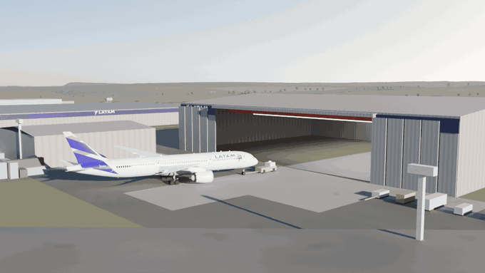
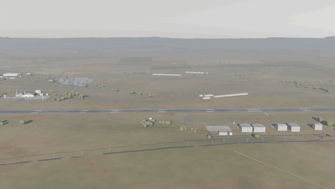
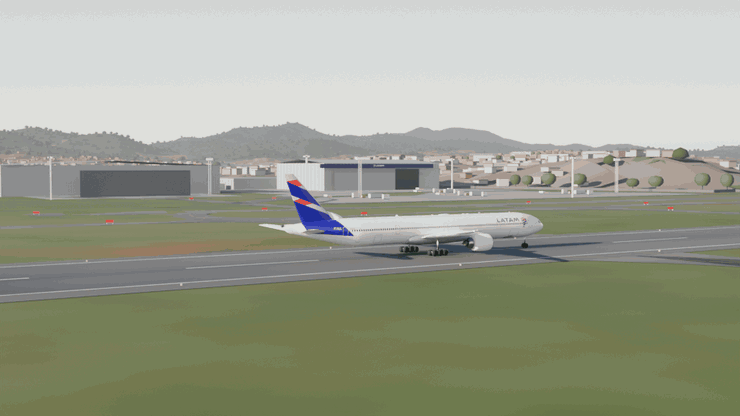
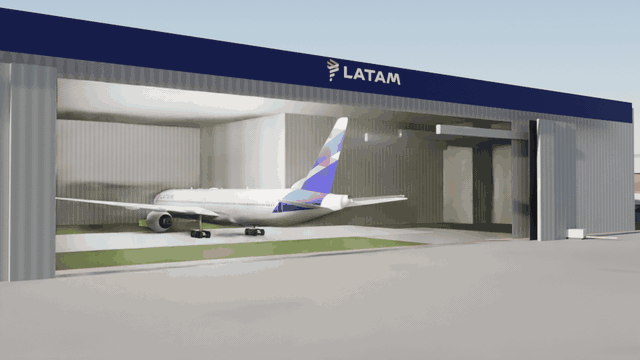
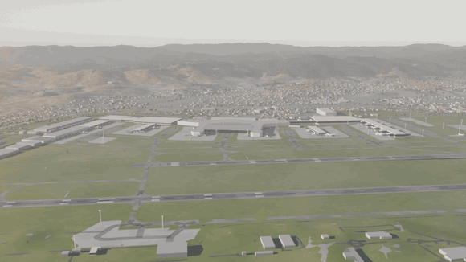

# LATAM fleet — 3D replicas

Blender models of LATAM Airlines aircraft, built to one standard: **the
dimensions have to match the manufacturer's document, and the paint has to match
a photograph of that specific registration**. The bar is not "it looks like an
airliner" — it is a LATAM engineer recognising their own aircraft.

Modelling by eye is fast and comes out wrong, so the rule here is **no mesh
before there is a number**. Every dimension traces back to an official
manufacturer document (Airbus *ACAP*, Boeing *Airplane Characteristics*), and
whatever the document does not carry — how the livery is applied, where the
indigo wedge crosses the door, the exact shade — is measured photogrammetrically
from photographs of that registration, with the uncertainty written down. The
payoff is that the model is **reconstructible**: each aircraft's
`spec_<type>.json` holds the complete engineering specification, and the scripts
rebuild from it.

## The fleet

The whole LATAM passenger fleet — nine types — plus both halves of the cargo
fleet. Eleven aircraft, each gated against photographs of its own registration,
each shown from the three angles that answer the three questions: the shape, the
proportions and paint along the hull, and the tail, where this project spent most
of its measurement.


**Airbus A319 (ceo)** · PT-TMT · 33.84 m · [`A319_LATAM.blend`](airbus%20A319/A319_LATAM.blend)


**Airbus A320ceo** · CC-BFO · 37.57 m · [`A320ceo_LATAM.blend`](airbus%20A320ceo/A320ceo_LATAM.blend)


**Airbus A320neo** · PT-TMN · 37.57 m · [`A320neo_LATAM.blend`](airbus%20A320neo/A320neo_LATAM.blend)


**Airbus A321-231 (ceo)** · PT-MXP · 44.51 m · [`A321ceo_LATAM.blend`](airbus%20A321ceo/A321ceo_LATAM.blend)


**Airbus A321neo (ACF)** · PS-LBA · 44.51 m · [`A321neo_LATAM.blend`](airbus%20A321neo/A321neo_LATAM.blend)


**Boeing 767-300ER** · CC-CWY · 54.94 m · [`B763_LATAM.blend`](boeing%20767-300ER/B763_LATAM.blend)


**Boeing 767-300F** · N536LA · 54.94 m · *LATAM Cargo Colombia, factory freighter* · [`B763F_LATAM_CARGO.blend`](boeing%20767-300F/B763F_LATAM_CARGO.blend)


**Boeing 767-300BCF** · CC-CXE · 54.94 m · *LATAM Cargo Chile, converted* · [`B763BCF_LATAM_CARGO.blend`](boeing%20767-300BCF/B763BCF_LATAM_CARGO.blend)


**Boeing 777-300ER** · PT-MUG · 73.86 m · [`B77W_LATAM.blend`](boeing%20777-300ER/B77W_LATAM.blend)


**Boeing 787-8 Dreamliner** · CC-BBF · 56.72 m · [`B788_LATAM.blend`](boeing%20787-8/B788_LATAM.blend)


**Boeing 787-9 Dreamliner** · CC-BGK · 62.81 m · [`B789_LATAM.blend`](boeing%20787-9/B789_LATAM.blend)

Together they cover the 356 passenger aircraft LATAM operates — the A320ceo
alone accounts for 135 of them — and the 19-aircraft cargo fleet in both of its
halves, 7 built as freighters and 12 converted. LATAM Cargo is not the passenger
livery repainted: the hull is white to the belly, the rear wedge is smaller, the
lockup runs LATAM over CARGO, the winglets are indigo outboard and coral inboard,
and the belly carries the symbol alone. Only the fin sash passes through
unchanged.

## The three bases

Each airport is built once in its own folder and **linked** into the aircraft
files rather than copied, so a fix to a field fixes it for every clip shot there.
Each folder's `README.md` is that field's manual — the survey, what is measured
and what is estimated, the licences, and the geometry of every shot below.

### Santiago — [`scenario/`](scenario/)

**SCL / SCEL, Aeropuerto Internacional Comodoro Arturo Merino Benítez.** The
field with a skyline: the Andes close the horizon, and the earth's curvature is
baked into the terrain, because a heightfield dropped on a flat plane stands the
far cordillera hundreds of metres too tall. Departures are from **RWY 17R**, and
on a 17R departure every named feature on the field is on the left.


*An A320neo off 17R. The camera flies formation in the aircraft's own coordinate
frame from the first frame to the last — opening 130 m off the nose, holding
through the rotation, then craning up and away so the terminals, the LATAM base
and the cordillera open around it.*


*A northbound survey of the whole airport: the T1/T2 terminal core with its piers
and parked fleet, the control tower, and the LATAM base — one of every passenger
type in this repository standing on it — with both runways crossing the frame end
to end.*

### São Carlos — [`scenario_sdsc/`](scenario_sdsc/)

**SDSC / Aeroporto Estadual Mário Pereira Lopes**, Água Vermelha: LATAM's
heavy-maintenance base — nine hangars, 22 workshops, ~2 000 people, ~270 aircraft
a year, and **hangar 9**, opened 26 September 2025 for Boeing 787 heavy
maintenance. The runway is short, it falls 0.62% along its length, and the base
sits **35 m below it** — invisible from the pavement until the terrain uncovers
it.


*An A320neo off **RWY 02**. TORA here is 1 672 m and anything leaving is a ferry
flight, so it goes early: the wheels leave at 1 150 m with 522 m of runway still
ahead. The reveal is the terrain, not the camera — the base breaks the crest nine
frames after rotation, and by the close the apron, the nose-in line and hangar 9
are all open behind the climbing jet.*



*A **787-9** towed nose-first into **hangar 9** — the aeroplane the hangar was
built for and its 78 × 20.5 m door sized against. At the last frame the wingtips
sit in the opening with 8.94 m to spare each side.*



*The aerial tour: over the Aeroclube and the runway, across the mid-field cluster
with its chequerboard tower, and down onto the MRO — the 471 m hangar line, the
nose-in row, and hangar 9 standing apart from everything OpenStreetMap traced in
2017.*

### Guarulhos — [`scenario_sbgr/`](scenario_sbgr/)

**SBGR / Aeroporto Internacional de São Paulo/Guarulhos — Gov. André Franco
Montoro**: LATAM's hub, and the 777-300ER's home — the hangar where those
aircraft are maintained stands at the field's NE corner, and the ADC prints
HANGAR LATAM on the footprint. Two parallel runways 373 m apart with the fleet
holding between them, a field level to six feet across five kilometres, a horizon
that is a **ring** (+0.12° to +3.23°, never negative, all of it real terrain), and
the city wrapped around the fence instead of empty ground.



*The **777-300ER** off **RWY 10L**, one orbit flown in the aircraft's own frame
from the aft-starboard quarter. Rotation begins abeam the LATAM hangar at 2 571 m,
so the nose lifts exactly as the aeroplane's own maintenance base crosses the
frame behind it, under a 17:30 sun dead astern.*



*The roll-out, and the inversion of the São Carlos tow: the 777 comes out the way
an MRO actually releases one — **tail first**. The first thing to cross the door
line is the fin, sliding out of a dark bay into raking light through the 76 m
opening.*



*The aerial tour: the terminal crescent and tower, both runways crossing the
frame, the mid-field, and the close on the LATAM corner — the hangar, its 777,
the 901 widebody row — with Bonsucesso and the forested serra behind.*

## The scene studio

[`estudio/`](estudio/) is a browser page that loads the exported fleet **and the
three airports**, lets you **compose a scene** from them, and gets the result
back out four ways: an animated GIF, a navigable 3D embed you can drop into
another page, a scene JSON that round-trips, and a PNG still.

57 GLB assets in five categories — 11 aircraft, 22 airport structures, 7 ground
and surface pieces, 14 vehicles and GSE, 12 props — with **per-asset licensing**:
the aircraft are CC BY 4.0, the airport geometry is an OpenStreetMap derivative
under ODbL 1.0 with share-alike, and the studio's Licence panel lists whichever
licences the open scene actually uses. Four starter scenes are built on the real
bases: a stand at Guarulhos, hangar 9 at São Carlos, the 10R threshold, and the
whole 6.1 × 4.8 km Guarulhos field.

```bash
python3 -m http.server 8000      # from the repository ROOT, not from estudio/
open http://localhost:8000/estudio/
```

It has to be served over HTTP and rooted at the repository, because the page
reads `../export/manifest.json`, `../export/web/*.glb` and `../export/cenarios/`.
There is no build step
and it needs no internet: three.js, the Draco decoder and the GIF encoder are
vendored. [`estudio/README.md`](estudio/README.md) is the manual.

## Portable exports

The `.blend` is the master, but it only opens in Blender. [`export/`](export/) is
the same fleet in portable formats, generated by one command at the root:

```bash
python3 export_frota.py                 # whole fleet, both LODs  (~4 min)
python3 export_frota.py B77W --lod web  # one aircraft, light level
python3 export_frota.py --verificar     # read every .glb back and check it

python3 export_cenarios.py              # 46 airport pieces, three fields (~10 s)
python3 export_cenarios.py --listar     # the catalogue, without opening Blender
```

**glTF 2.0 binary (`.glb`) is the primary target**, in a faithful level and a
genuinely light one for three.js (Draco, around 0.5 MB per aircraft); USDZ, FBX
and OBJ+MTL come out alongside for AR Quick Look, Unity/Unreal and everything
else. [`export/viewer.html`](export/viewer.html) is a one-file three.js viewer —
serve `export/` over HTTP and open it.

[`export/cenarios/`](export/cenarios/) is the second tier: 46 composable pieces
of the three aerodromes — hangars, terminals, towers, a jetbridge, runway and
apron sections, GSE, masts, fences, and three whole-field plates — cut out of
`scenario*/` by `export_cenarios.py`. **53,797 faces and 0.47 MB of Draco GLB
for the whole catalogue.** They are an OpenStreetMap derivative and therefore
**ODbL 1.0 with share-alike**, which NOTICE.md permits and which every asset
carries in its own manifest row and in its own `.glb` copyright string. Formats,
LOD trade-offs and licensing: [`export/README.md`](export/README.md).

The airports are **not** exported. They are OpenStreetMap derivatives under
share-alike ODbL, a different obligation from the models' CC BY 4.0.

## Building an aircraft

Blender 5.2+. Open any aircraft's `.blend` and render — textures and materials
are packed into the file.

The whole repository uses one coordinate frame; mixing frames is the easiest way
to produce a crooked aircraft:

- **x = 0 at the nose tip**, increasing aft, in metres
- **z = 0 at mid-height of the constant section**, positive up
- **y = 0 on the symmetry plane**, positive to starboard

Watch out for manufacturer datums: Airbus stations are measured from an X0 that
sits 2540 mm ahead of the nose tip (`x = STA − 2540`).

Nothing ships without passing the visual gate — **eight canonical angles** shot
at a fixed distance (`3.00 × length` for whole-aircraft angles, `1.25 × length`
for the nose close-ups) with the lens derived from it, so every aircraft is
judged with the geometry of a reference photograph rather than a short lens at
18 m. "Passing the gate" means opening the images and looking.

```bash
/Applications/Blender.app/Contents/MacOS/Blender -b "boeing 787-9/B789_LATAM.blend" \
    --python render_gate.py -- 1600 96
python3 verificacao_visual.py "boeing 787-9"
```

The pipeline is encoded as skills under [`.claude/skills/`](.claude/skills/) —
each one carries the traps that already cost rework:

| Skill | What it covers |
|---|---|
| [`nova-aeronave`](.claude/skills/nova-aeronave/SKILL.md) | router: end-to-end pipeline for a new or derived aircraft |
| [`fontes-aeronave`](.claude/skills/fontes-aeronave/SKILL.md) | official ACAP/APR, registration photos, open CAD and licensing |
| [`extrair-cotas`](.claude/skills/extrair-cotas/SKILL.md) | drawing and photo → `curves.json` + `spec_<type>.json` |
| [`casco-parametrico`](.claude/skills/casco-parametrico/SKILL.md) | hull, wings, empennage and details in Blender |
| [`livery-latam`](.claude/skills/livery-latam/SKILL.md) | palette, official marks, paint as UV texture, tail sash and rear wedge |
| [`camera-animation`](.claude/skills/camera-animation/SKILL.md) | the clips: camera moves, how they are measured, the GIF law |
| [`blender-mcp`](.claude/skills/blender-mcp/SKILL.md) | driving Blender over MCP: timeouts, the render-file race |
| [`verificacao-visual`](.claude/skills/verificacao-visual/SKILL.md) | the quality gate: canonical angles, contact sheet, checklist |

## How this repository works

| Where | What it holds |
|---|---|
| [`PENDENCIAS.md`](PENDENCIAS.md) | the live to-do list, ordered by impact on realism |
| [`QA-BACKLOG.md`](QA-BACKLOG.md) | defects found, defects fixed, and defects measured and exonerated |
| [`REBUILD.md`](REBUILD.md) | the single rebuild sequence per aircraft |
| [`FONTES-FROTA.md`](FONTES-FROTA.md) | official document and usable open CAD, per variant |
| [`NOTICE.md`](NOTICE.md) | licences, trademarks, third-party material, the photograph policy |
| `scenario*/README.md` | each field's survey, licences and shot geometry |
| `<aircraft>/spec_*.json` | the complete engineering specification, including how a derived type differs from its master |

To run the pipeline from scratch you need the manufacturer documents and the
brand vectors, which are **not in this repository** for licensing reasons —
[`NOTICE.md`](NOTICE.md) lists each one and where to get it. The reference
photographs are cited, never committed: `python3 refs_fetch.py` re-downloads
them, and `--verificar` is the gate to run before committing.

## Licence

- Code, skills and engineering data: **[MIT](LICENSE)**
- 3D models, renders and animations: **[CC BY 4.0](https://creativecommons.org/licenses/by/4.0/)**

**LATAM**, **Airbus**, **Boeing** and **Dreamliner** are trademarks of their
respective owners. This is an independent, non-commercial project with **no
affiliation, sponsorship or endorsement** from any of them. Details and excluded
third-party material: [`NOTICE.md`](NOTICE.md).
