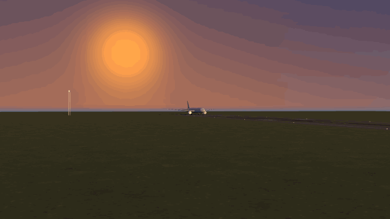

# `estudio/` — the scene studio

A browser page that loads the exported fleet **and the three airports**, lets
you **compose a scene** from them, **animate it on a timeline**, and gets the
result back out five ways: an **animated GIF**, a **PNG sequence** for a real
encoder, a **navigable 3D embed** that plays the clip, a **scene JSON** that
round-trips, and a **PNG still**.

57 GLB assets: 11 aircraft (CC BY 4.0) and 46 pieces of Guarulhos, São Carlos
and Santiago (ODbL 1.0, share-alike), plus 9 authored massing props.

It is a sibling of [`export/viewer.html`](../export/viewer.html), not a
replacement: the viewer answers *did the GLB export correctly*, the studio
answers *what does a scene made of them look like, and how do I ship it*.

```bash
# from the repository ROOT, not from estudio/
python3 -m http.server 8000
open http://localhost:8000/estudio/
```

**It must be served over HTTP, and the server must be rooted at the repository**,
because the page reads `../export/manifest.json`, `../export/web/*.glb` and
`../export/cenarios/`. A
`file://` page is not allowed to fetch them; that is a browser rule, the same
one documented in [`export/README.md`](../export/README.md). There is no build
step: three.js, the Draco decoder and the GIF encoder are **vendored** under
`vendor/`, so the page also needs no internet.

There is a `.claude/launch.json` at the repository root with the same server
under the name `estudio`, for tools that read it.

---

## Licence — read this before you export anything

**Two tiers, two licences, and the studio computes which ones YOUR scene
carries.** The Licence button in the top bar does not make a blanket claim about
the page; it lists the licences of the assets actually placed in the open scene,
and the export dialogs, the generated embed and the scene JSON carry the same
list.

| | what it is | licence | attribution |
|---|---|---|---|
| the 11 **aircraft** | original geometry built here from the manufacturers' published dimensional documents | CC BY 4.0 | *LATAM fleet 3D replicas — Kim Lage — CC BY 4.0* |
| the 46 **airport pieces** | cut out of `scenario/` (SCL), `scenario_sdsc/`, `scenario_sbgr/`, which are generated from **OpenStreetMap** | **ODbL 1.0, share-alike** | *Airport geometry © OpenStreetMap contributors, ODbL 1.0* |
| the **grounds, sky and massing blocks** | authored in [`js/props.js`](js/props.js) from primitives and canvas painting | CC BY 4.0 | as the aircraft |

A mesh built from an ODbL database is a derived database, so the airport pieces
carry share-alike — and ODbL *permits* that redistribution as long as the
attribution travels and share-alike is honoured. See
[`../NOTICE.md`](../NOTICE.md) §"The airport mesh is an OSM derivative". An
earlier round of this studio refused to load any of it on the belief that ODbL
and CC BY "conflict"; they do not, and the fix was not to hide the geometry but
to **license per asset**. Every scenery row in
`../export/cenarios/manifest.json` carries a `licenca` field, every scenery
`.glb` carries the attribution in its own `asset.copyright`, and cards for
share-alike assets show an **ODbL** badge in the sidebar — before you place one,
not after you export.

**Copernicus terrain is not exported at all.** The height fields under
`scenario*/` are 3.7 M faces at SBGR alone; no asset here references them. The
manifest still carries the Copernicus row so the panel can show it the day one
does.

**What the airport pieces lose on the way out.** Their materials are procedural
node trees — noise, range maps, a haze group — that glTF cannot carry. The
exporter flattens each to a representative colour read from the material's own
`diffuse_color`, which the scenery builders set deliberately; all 93 resolved
that way, none needed a fallback. The pavement is the right grey. It is not the
pavement a Cycles render of the field gives you, and
`materiais_achatados` in the manifest records the substitution material by
material.

**Trademarks.** LATAM, Airbus and Boeing are their owners'. This is an
independent, non-commercial project. See [`../NOTICE.md`](../NOTICE.md).

The same text is in the studio, behind the **Licence** button in the top bar.

**Vendored third-party code** — `vendor/three` (three.js r169, MIT),
`vendor/three/draco` (Draco decoder, Apache-2.0, Google), `vendor/gifenc`
(gifenc 1.0.3, MIT, Matt DesLauriers). Licence files ship alongside each.

---

## The facts it relies on

Everything below is read out of `export/manifest.json`,
`export/cenarios/manifest.json` or measured from the loaded geometry — nothing
about the fleet or the airports is hard-coded in this folder, including the
sidebar's section names.

| Fact | Where it comes from | Why the studio needs it |
|---|---|---|
| **+Y up, metres** | glTF convention; `export_frota.py` verifies it | the ground plane is `y = 0` |
| **wheels on `y = 0`** | the exporter moves the height datum, and checks it | the ground datum; "snap to ground" starts from it |
| **nose at `x ≈ 0`, tail at `x ≈ +L`** | repository frame; the bbox proves it | the aircraft's forward direction is **−X**; the "front" camera preset looks along +X, and the GIF "travel along the nose" moves along local −X |
| **span along Z, straddling 0** | exporter's symmetry check | line-ups are Z offsets |
| **Draco-compressed** | `KHR_draco_mesh_compression` in every `web` GLB | `DRACOLoader` is wired, decoder vendored |
| **clearcoat paint** | `KHR_materials_clearcoat` on 12–28 materials | an environment map is not optional — with only direct light the livery reads as flat vinyl. Default environment is the generated sky; `RoomEnvironment` is offered as "studio" |
| name, registration, triangles, materials, bytes, bounding box | `manifest.json` `verificacao` block | the sidebar cards and the selection read-out |
| **`categoria` and `licenca` per asset** | both manifests | the five sidebar sections, the ODbL badge, the Licence panel, the embed's credit line |
| **airport pieces already centred** | `export_cenarios.py` measures and verifies it | the studio does **not** re-centre them — see below |
| **field plates datumed on the runway threshold** | `datum: "campo"` in the scenery manifest | part of the plate is below `y = 0` on purpose, and "snap to ground" must not clamp there |

**Aircraft instances are wrapped in a pivot group** whose origin sits at the
model's X/Z bounding-box centre with `y = 0` at the wheels — measured from the
loaded geometry, not from the manifest. Without it a turntable would spin the
aircraft about its nose tip and the gizmo would sit in front of the radome.

**Airport pieces are NOT re-centred here.** They arrive already centred, and in
three cases centred deliberately somewhere other than the box middle: a runway
section is centred on the *runway*, because a PAPI on one side alone pulls the
bounding box 21 m off the centreline. Re-measuring and re-centring them in the
browser silently undid that decision, and the 777 of the runway starter stood
with its gear on the shoulder until somebody looked at it from above.

A twelfth aircraft — or a forty-seventh hangar — needs no edit here: export it,
and it appears, under its own category, with its own licence.

---

## What is in the page

### Two libraries, deliberately separate

**Assets** — 66 cards in five sections, and the sections come from the
manifests rather than from this folder:

| section | count | what is in it |
|---|---:|---|
| aircraft | 11 | the fleet, with registration, measured length and triangle count |
| airport structures | 22 | hangars, terminals, towers, a jetbridge, a cargo shed, the MRO frontage |
| ground & surfaces | 7 | a runway threshold section, a taxiway section, apron slabs, three whole-field plates |
| vehicles & GSE | 14 | tug and towbar, GPU, air start, belt loader, catering, cargo loader, stairs, bus, bowsers, cherry picker, van, dolly train |
| props | 12 | masts, fences, maintenance docks, engine stands, containers, cones, massing blocks, the backdrop card |

The authored props from [`js/props.js`](js/props.js) carry the same category
vocabulary as the surveyed pieces, so both file into the same sections and one
filter box searches across everything — name, slug, field, category, licence and
the asset's own note. Cards for share-alike assets carry an **ODbL** badge, and
anything wider than 300 m is flagged **▮ large**: it is a backdrop, not a
building block. Click to add at the orbit target, or drag onto the viewport to
drop at that point on the ground. New objects are nudged clear of what is
already there — except pieces over 300 m across, which neither move nor push,
because you drop a jet *onto* a runway, not beside it.

Thumbnails are **rendered from the real GLB** in a throwaway 168×114 context,
one at a time, and cached in `localStorage` — so the second visit shows them
without fetching 10 MB again. They are a smoke test as much as a picture: a
thumbnail that never appears is a GLB that did not load. All 57 render.

**Scenes** — nine starter compositions plus your own, saved in `localStorage`
with load / save / duplicate / rename / delete.

Five are fleet-only: single hero, line-up of the family, cargo ramp, turntable
showcase, night ramp. **Four are built on the real bases** and are what the
airport tier is for:

| starter | what is in it |
|---|---|
| **Stand at GRU** | A320neo at the gate: apron slab, terminal block, a jetbridge docked at the L1 door, catering, cargo loader, tug and towbar, bowser, apron bus, two floodlight masts |
| **Hangar 9, São Carlos** | 787-9 nose-in on the door line, the MRO hangar bay behind, maintenance dock, engine stands, containers, GSE, perimeter fence |
| **Runway 10R at GRU** | 777-300ER lined up on the threshold, on the real 10R marking geometry, with two lattice masts |
| **The whole field — GRU** | the 27,648-face field plate, 6.1 × 4.8 km, with a 777 rolling 10L, an A320neo holding short, and the control tower |

Starters carry a camera *direction*, not a position: they are framed on open
from the measured bounding box of the **aircraft** in them, so a 210 m backdrop
card — or a 6 km field plate — cannot decide the shot. A scene whose subject
*is* the field says `quadro: 'tudo'` and gets framed on everything.

In *The whole field*, the three placed objects are **not eyeballed**: the
aircraft and the tower are positioned from each asset's recorded origin in the
field, so they stand where they stand at Guarulhos. That is the arithmetic check
on the whole export, done where you can see it.

Starters may also ask to be **seated** (`assentar`), which drops every aircraft
onto whatever is beneath it once, on open. Field plates and runway sections are
real surfaces with real relief — GRU's 10L is 0.39 m below the threshold datum
where the starter puts the 777 — and hard-coding those numbers would make them
go stale the day a plate is re-cut.

### Controls

| Group | What is there |
|---|---|
| **Camera** | orbit / pan / dolly (OrbitControls, damped, no going under the tarmac); presets front / side / top / 3-quarter / hero; frame selected (F) and frame all (A); FOV slider; orthographic toggle that keeps the same apparent height; store pose A / pose B |
| **Object** | click-select in the viewport and in the outliner; shift-click to add to the selection; move / rotate / scale gizmos (W / E / R) with X / Y / Z axis constraints; local/world space (Q); numeric position, rotation and scale fields; translation and rotation snap increments; snap to ground (G); duplicate (Ctrl+D); delete (Del); per-object lock and hide; undo / redo (Ctrl+Z, Ctrl+Shift+Z). The selection read-out adds the asset's field, its licence and its note |
| **Scene** | sun elevation / azimuth / intensity / colour; environment (generated sky, RoomEnvironment, none) and its intensity; background (sky, solid colour, transparent); exponential fog; ground on/off with six materials and a size; grid |
| **Render** | tone mapping (ACES Filmic, AgX, Khronos Neutral, Reinhard, Linear); exposure; shadows on/off; shadow map 512–4096; export sampling 1–3×; pixel-ratio cap |
| **Colour grade** | contrast, saturation, black lift, warm/cool, vignette — applied after tone mapping, in display space. **No motion blur**, and there will not be a fake one; see below |
| **Timeline** | clip length and frame rate; a scrubbable playhead; play / pause / loop (space, ←/→, shift+←/→, Home/End); auto-key; an explicit **key** button (K); per-track mute and delete; per-key easing; draggable keys; `Motion…`, which writes flights and the four old GIF motions. Toggle the dock with **T** |

The status line under the viewport reports fps, object count, triangles, draw
calls and how many bytes of GLB have been fetched.

**Multi-select** attaches the gizmo to a pivot at the selection centroid and
re-parents the selected objects under it **for the duration of the drag only**,
with `Object3D.attach()` so world transforms are preserved. Attaching after the
pivot has moved pins the objects where they already are and the drag silently
does nothing — that bug was in this file for an hour, which is why the
bracketing is spelled out in [`js/editor.js`](js/editor.js).

### Airport scale needed four things fixed, and each was found by looking

Composing at 6 km instead of 60 m broke assumptions the studio had been getting
away with. All four were visible on screen before they were understood:

- **Depth range.** `near`/`far` used to be pinned when a box was framed. Framing
  a field plate gave `near = 55 m`, which clipped every aircraft you then flew
  up to. They now track the **orbit distance** (`near = 1 % of it`, clamped),
  which holds the ratio near 3000:1 at every zoom — a first attempt at this
  reached 20000:1 and z-fought a 6 cm apron slab against the ground plane.
  Deriving from distance also survives the orthographic toggle, which a
  logarithmic depth buffer would not.
- **Surfaces do not cast shadows.** A zero-thickness apron 6 cm above the
  ground, casting into a shadow map whose texel is 26 cm at a 27° sun, shadows
  *itself* in stripes across the whole ramp. Assets in the *ground & surfaces*
  category receive shadows and are not occluders. No bias tweak fixes that; the
  surface simply should not be one.
- **The sun aims at the small objects.** Both the sun's position and the shadow
  frustum come from the bounding box of everything under 300 m wide. Using the
  whole scene put a 9.7 km shadow map at 2048 px — 4.8 m per texel, which is not
  a shadow.
- **Snap to ground means "onto what is below".** It raycasts down onto the other
  objects and lands on the highest surface under the footprint, with `y = 0` as
  the floor *only when there is a floor*: a field plate datumed on the threshold
  runs below zero over most of the aerodrome, and clamping there left the 777
  hovering. The five samples are the centre and a cross at ±15 % of the
  footprint — sampling the corners would let a wingtip over a container lift the
  whole aeroplane onto it.

**Undo is a snapshot stack, not a command stack.** One serialiser, one restorer,
no third code path that can disagree with them. The snapshot is taken *after*
each mutation and the cursor points at the current state; taking it before
gives you an undo that works and a redo that cannot, because the post-change
state was never written down. Restoring is cheap: GLB payloads are cached and
instances are `Object3D.clone()`s sharing geometry and materials.

---

## The timeline

Before there was one, the studio could animate exactly one thing at a time,
through four canned motions parameterised by a normalised *t*. That is a
showroom loop, not a clip. The timeline replaces it, and the four motions are
still there — as **presets that write keys you can then drag**.

**The timeline lives in the scene document**, at `estado.linha`, and that single
decision is what makes it undoable, savable, embeddable and exportable without a
second code path. The schema stays `latam-estudio/1`: a reader that predates the
timeline opens such a document and shows the scene at rest, which is the correct
degradation and a better outcome than a version bump that would make it refuse.

```jsonc
"linha": {
  "duracao": 7.95,          // seconds
  "fps": 20,                // only rates whose GIF delay is a whole centisecond
  "loop": true,
  "autochave": false,       // auto-key
  "trilhas": [              // keyframe tracks
    { "id": "t1x2y", "canal": "camera.alvo", "ref": null, "mudo": false,
      "chaves": [ { "t": 0, "v": [-232, 6.7, 0], "e": "pchip" },
                  { "t": 1.35, "v": [-135.6, 6.7, 0], "e": "pchip" } ] }
  ],
  "voos": [ … ]             // flight behaviours — see below
}
```

| channel | target | what it drives |
|---|---|---|
| `objeto.pos` `objeto.rot` `objeto.esc` | one scene object | position (m), rotation (degrees, XYZ), scale |
| `objeto.visivel` `objeto.trem` | one scene object | visibility, and the landing gear — both **held**, never interpolated |
| `camera.pos` `camera.alvo` `camera.fov` | the camera | where it is, what it looks at, the lens |
| `sol.elev` `sol.azim` `sol.intensidade` | the sun | time of day, **including the shadows** |
| `render.exposicao` | the renderer | a fade, or a stop of recovery over the clip |

A key is `{ t, v, e }`: a time on the frame grid, a number or a triple, and an
easing that governs the segment **leaving** it — Blender's convention, and the
reason the last key's easing is inert.

### Interpolation: monotone cubic, and this project already knew why

The default is **PCHIP** — cubic Hermite with Fritsch–Carlson tangents. C¹,
monotone, no overshoot, and a real derivative at every interior knot.

The alternative was a smoothstep, and this repository has paid for that curve
twice and written it down both times:

- [`scenario_sbgr/shot_common.py::_slopes`](../scenario_sbgr/shot_common.py) —
  a chain of smoothstepped camera segments has **zero derivative at every knot**,
  which produced a 107 m/s² acceleration spike in the São Carlos module this one
  was ported from.
- [`scenario_sbgr/place_777.py::_subida`](../scenario_sbgr/place_777.py), fixed
  in `96a2371` **the same day this timeline was built** — the same curve was
  still in the aeroplane's own climb. At the lift-off frame the vertical speed
  was 0.006 m/s and took nearly a second to reach 0.6: on screen the 777 clung
  to the runway after its wheels were off.

Per-key easing is offered — `linear` (constant rate, exact, and what a turntable
wants), `suave` (smoothstep, which stops dead at *both* knots and is right for a
single deliberate ease), `segurar` (hold) — but the default is the one that is
correct, and the diamond on the track is shaped and coloured by its easing so
you can see which is which without opening anything.

**Two end conditions, and the difference matters.** Keyframe tracks use
`m₀ = mₙ₋₁ = 0`, so a clip starts and ends at rest — what a camera move wants,
and what `shot_common._slopes` itself ships. A **flight path** uses secant end
conditions instead: with zero tangents an aeroplane would ease into and out of
its own take-off roll, which is the runway-sticking bug wearing a different hat.

### Flight — the attitude is derived, not keyed

A flight is not a transform track. It is a **path** (waypoints carrying an
altitude above the surface and a ground speed) plus a speed schedule, and
everything about how the aeroplane is *pointing* falls out of it:

| | |
|---|---|
| **heading** ψ | the horizontal tangent of the path. The nose is local −X, so ψ = atan2(dz, −dx) — checked against `cenas.js`, where GRU's 10L track (16.354° off +X) is written 196.354, which is exactly what this returns for that tangent |
| **bank** φ | `tan φ = v·ψ̇ / g`, the coordinated-turn relation: the bank at which the lift vector's horizontal component supplies the centripetal acceleration the turn needs. Rate-limited (a transport rolls at 5–10 °/s) and capped. **The sign is worked out, not guessed**: d(forward)/dψ at ψ = 180° is (0,0,−1) while starboard there is (0,0,+1), so increasing ψ swings the nose to *port*, and a coordinated left turn puts the *port* wing down. Without the minus sign the aeroplane banked away from every turn it made |
| **pitch** θ | `θ = γ + α`, where γ = atan(vs/v) is the flight-path angle read off the path and α is the angle of attack. α is not free: lift = ½ρv²S·C_L must equal the weight and C_L ≈ C_Lα·α, so **α ∝ 1/v²**. One number, `alfaRef` at `vRef`, and the model scales it |
| **the rate limiter** | θ is then rate-limited at `taxaRot` °/s, and that one limiter does three jobs: the rotation on take-off (the target jumps to the take-off attitude at the rotation point and the nose walks up at 3.1 °/s, which is what makes a loaded 777 look loaded), the flare, and the de-rotation on landing |

**The ground segment** needs no special case, because the path describes the
**main-gear contact point** — on the pavement and in the air alike. Put that
point where the path says it is, hang the body off it by the measured gear
offset, and "rotate about the main gear" is what happens. The gear offset is
measured off the GLB at instancing time: every aircraft here names its gear
meshes (`TremNariz_*`, `TremP*`), 15 nodes on an A319 and 32 on a 787, and the
777's main gear solves to x = 0.08 m from the instance's own origin. **Gear up
is a key**, on the `objeto.trem` channel, held — because retraction is something
a pilot does and you should be able to drag it.

**Altitude is above the surface, blended.** At the pavement it *is* the pavement
— GRU's 10R threshold section falls 18 cm across the take-off roll and the
wheels follow it — and by 50 m up the datum is the surface height where the
route began. Without that blend a flypast at 90 m AGL crossing a 26 m hangar
climbs 26 m to keep its clearance, and the milder version of it showed up as
±0.7 m/s of phantom climb where a path leaves the runway slab.

**What is deliberately not modelled:** thrust, drag, weight, wind, ground
effect, flap schedule. This is authoring, not a simulator. Every number below is
a profile chosen to read right; the derivations above are what keep the profile
self-consistent once you drag a waypoint.

#### The two calibrations, and where they were measured

| | heavy | light |
|---|---|---|
| source | [`scenario_sbgr/place_777.py`](../scenario_sbgr/place_777.py) — the GRU 777-300ER departure | [`scenario_sdsc/place_aircraft.py`](../scenario_sdsc/place_aircraft.py) — the São Carlos ferry A320 |
| lift-off speed | 83 m/s | 58 m/s |
| acceleration | 1.4 m/s² | 1.6 m/s² |
| rotation rate | 3.1 °/s to 12.0° | 3.5 °/s to 13.0° |
| climb gradient | **11 %** | **21 %** — twice the 777's, on a runway half the length |
| approach | 71 m/s | 62 m/s |

The chooser is the aircraft's **own measured length** (≥ 55 m is heavy), so a
twelfth aeroplane exported tomorrow lands on the right side of the line with no
table of type names anywhere.

Two differences from the Blender profile, both deliberate:

- the Blender clip rotates for 32 frames and then **jumps the pitch from 4° to
  12° in one frame**. A rate limiter cannot do that, and it should not; the
  recipe instead sets the rotation distance to `pitch ÷ rate × speed` so the
  attitude is reached exactly *at* lift-off.
- the climb is an exponential approach in *distance*, `alt(x) = G(x − Lₑ(1 −
  e^{−x/Lₑ}))`, whose gradient has its **maximum derivative at lift-off**. The
  waypoints through the first 120 m are deliberately dense, because the monotone
  interpolator sets the tangent to zero at a knot where a flat segment meets a
  climbing one — the same dead knot, reintroduced by the interpolation rather
  than by the profile.

#### The three recipes

`Motion…` in the dock, with an aircraft selected. Each starts the route **where
the aeroplane stands, along the heading it already faces** — nothing about GRU
or about any runway is written into `presets.js`. Each optionally writes a
camera track sampled *from the flight*, so the pan is exactly as fast as the
aeroplane is at every instant.

| recipe | what it builds | measured on the 777, 8 s |
|---|---|---|
| **take-off** | roll, rotation about the main gear, lift-off, exponential climb-out, a gear-up key six seconds after the wheels leave *if the clip lasts that long* | 644 m of path, wheels off at 5.14 s after a 409 m roll, pitch exactly 12.00° at lift-off rising to 12.7°, a 10.2 % gradient |
| **landing** | 3° approach, flare, touchdown at the aeroplane's current position, decelerating rollout with the nose coming down | peak descent 3.85 m/s, **0.78 m/s at the wheels**, pitch 6.9° through the flare |
| **flypast** | a low pass with a turn through it, so the derived bank is visible | 20.4° of bank into a port turn — the port wingtip 10.4 m below the starboard one, which is 30 m × sin 20.4° |

The landing's flare took two attempts and the second one is the point of having
a flight panel that *measures*. The first was an exponential in distance-to-go,
which is beautifully flat at the wheels and therefore **steep at the top**,
because all the height it had to lose was still there: the panel read −9.63 m/s
peak descent on what is meant to be a 3° approach at 71 m/s, i.e. 3.72. The
aeroplane dived into its own flare. What a flare *is*, is the descent rate
bleeding off, so the path's slope now goes linearly from the glideslope to
almost nothing and the height is its integral — continuous in both value and
slope, with no dive anywhere.

### Auto-key, and one rule that is not the DCC default

| | |
|---|---|
| auto-key **on** | a move writes keys on position, rotation and scale, starting the tracks if they do not exist; the eye button in the outliner writes a visibility key |
| auto-key **off** | a move on a channel that is **already animated** still writes a key |

Blender discards that second drag. This studio does not, because the next frame
would re-evaluate the track, the object would snap back, and there is no F-curve
editor here to explain where the drag went.

**Scrubbing writes nothing.** Moving the playhead is not an edit; a timeline
that filled the undo stack with playhead positions would make undo useless
exactly when it is needed. Keys, retimes, easings, flights and clip settings are
each one history entry, and they ride in the same snapshot stack as everything
else — undo undoes a key exactly the way it undoes a move.

## The five exports

### 1. Animated GIF

The **GIF law** of this project is arithmetic, not taste: a GIF frame delay is
an integer number of **centiseconds**. 25 fps is 4 cs exactly. 24 fps is
4.1666… cs, so every encoder alternates 4 and 5 and the motion visibly stutters
on a 12-frame cycle. The frame-rate menu therefore offers only rates that divide
100 evenly — 25, 20, 12.5, 10, 5 — and prints the delay it will write.

Encoder: **gifenc**, vendored. It does not dither at all; each pixel goes to the
nearest palette entry. That satisfies "no dithering by default" and it also
means the **colour count is the only quality/size knob**, which is why the
dialog puts it next to the resolution.

The palette is **global, built in a first pass** from four sampled frames (t =
0, ¼, ½, ¾) rather than per frame: a per-frame table looks marginally better on
a single frame and flickers across a loop. The second pass renders and encodes
frame by frame and keeps no buffers, so a 90-frame 960 px export does not need
200 MB of RAM.

**The motion is the timeline**, and it is the default the moment the scene has
one. In that mode the frame count and the frame rate are the *clip's*, not the
exporter's, and the fields go read-only: a GIF that renders a different number
of frames than the playhead showed is a GIF nobody can direct. Frame *i* is
exactly the frame the playhead shows at *i*/fps.

The four old motions are still in the menu for a scene JSON that predates the
timeline, and they behave as they always did. But the way to *get* one now is
`Motion…` in the dock, which writes it as keys — and the keys are chosen so the
motion is *exactly* what it claims:

- a **turntable** is 33 camera keys on a circle with **linear** easing, which
  makes the angular rate exactly constant (measured at 45.0000 °/s at every
  probe) and the loop seamless — PCHIP's zero end tangents would stop it dead at
  the seam. The cost is that the path is a 32-gon, so the radius wobbles by
  1 − cos(π/32) = **0.483 %**, measured. At the 16 keys this was first written
  with it was 1.94 %, which is enough to pulse the subject's apparent size eight
  times a revolution, and was visible.
- an **object spin** is 5 rotation keys, also linear, so the rate is exact.
- a **camera path** is 2 keys, or 3 with ping-pong, on PCHIP — whose zero end
  tangents are exactly right here: the move starts and ends at rest.

Every motion is bracketed by save/restore: an export leaves the scene, the
camera and the object exactly where they were. The interactive render loop is
paused for the duration, because `OrbitControls.update()` would otherwise
overwrite the camera the motion function just set — the classic "my GIF is 60
copies of one frame" bug.

**Sizes, measured.** Two 640×360 12-frame turntables at 2× supersampling (the
default), bytes per pixel per frame:

| colours | 32 | 64 | 128 | 256 |
|---|---:|---:|---:|---:|
| *Single hero* (smooth sky, one aircraft) | 0.035 | 0.050 | 0.063 | 0.082 |
| *Line-up of the family* (textured concrete, five) | 0.111 | 0.169 | 0.196 | 0.212 |

A factor of three between two perfectly ordinary scenes — LZW on a smooth sky
gradient and LZW on tiled concrete are not the same problem. Supersampling
*helps* the smooth scene (0.092 → 0.063 at 128 colours, cleaner edges compress
better) and slightly hurts the busy one (0.175 → 0.196). The live estimate uses
the geometric mean of those two columns, so it is honest to **about a factor of
2 either way**; it exists to make the trade visible, not to be precise. The line
the dialog prints *after* the encode is the real file size and the real
bytes-per-pixel.

A representative export, verified with PIL rather than by eye:

```
640×360, 60 frames, 2× supersample, 128 colours   →  917 kB in 1.1 s
PIL: frames 60, unique durations {40 ms}, loop 0
```

And the shipped example clip, same treatment:

```
640×360, 159 frames, 2× supersample, 128 colours  →  2.60 MB in 2.2 s
                                                      0.075 bytes/pixel/frame
PIL: frames 159, unique durations {50 ms}, loop 0, 159 unique frames
```

**The encode is synchronous on the main thread and there is no worker.** The
dialog now says so *with a number* before you click: measured at about 19
million output pixels a second on the machine this was built on, GPU render
included, so 159 frames of 640×360 at 2× is 2 s and a 400-frame 960 px export
is nearer 15. A slower GPU will be several times worse. (The first version of
that line used a made-up constant and overstated the wait by seventeen times,
which is its own kind of dishonesty.) Moving the quantise-and-index pass to a
worker is possible — the render must stay on the main thread — and is **not
built**.

**A vignette and an 8-bit GIF are enemies**, which is worth knowing before you
reach for the grade. The palette is 128 or 256 colours and gifenc never dithers,
so a smooth gradient bands; a *horizontal* sky gradient bands into horizontal
stripes, which read as sky, while a vignette bands into **concentric arcs
centred on the frame**, which read as a defect. The shipped example carries
contrast, saturation, lift and a warm push, and no vignette at all, for exactly
that reason. Going 128 → 256 colours cost 24 % of the file and fixed almost
none of it.

### 2. PNG sequence

Every frame of the timeline as a PNG, at a chosen width and supersample, packed
into **one ZIP** — because two hundred separate downloads is not a feature any
browser will let you have. The ZIP is written by hand in about forty lines and
is **stored, not compressed**: PNG is already deflated, so compressing it again
buys nothing and costs a compressor. `unzip` opens it.

This is the honest answer to "can the studio make an MP4". It cannot; a browser
has no H.264 encoder worth the name. The dialog prints the command:

```bash
ffmpeg -framerate 20 -i quadro_%04d.png -c:v libx264 -pix_fmt yuv420p out.mp4
```

A transparent background keeps its alpha frame by frame, which combined with the
shadow-catcher ground is an aeroplane and its shadow over nothing.

### 3. Navigable 3D embed

An `<iframe>`-able HTML file. It does **not** re-implement the renderer: it
imports [`js/embed.js`](js/embed.js), which builds the *same* `Mundo` the studio
builds from the *same* scene document and simply never constructs the editor. If
a scene looks right in the studio it looks right in the embed, or both are
broken in the same place.

The dialog states, before you download, exactly what the file needs beside it:
every GLB with its real byte size and triangle count, an ODbL tag on the ones
that carry share-alike, the total payload, and the licence lines that will be
written into the page. If the payload passes 12 MB or 900 k triangles it says
so, in as many words, rather than shipping a page that hangs.

Three path modes:

| mode | `estudio/` at | GLBs at | use when |
|---|---|---|---|
| **relative** (default) | `./` | `../export/web/` and `../export/cenarios/` | you save the HTML **inside `estudio/`** — works the moment the repository folder is copied anywhere |
| **sibling** | `estudio/` | `./` | the HTML sits next to the `.glb` files |
| **absolute URLs** | typed | typed | hosted somewhere else |

Options: auto-rotate and its speed, allow zoom, allow pan. The dialog also
copies a ready `<iframe>` snippet.

The generated page carries **both licence lines** — in the HTML comment at the
top, in the visible credit bar, and in the `licencas` block of the scene JSON
baked into the file.

[`exemplo_embed.html`](exemplo_embed.html) in this folder is a real one,
generated by the page and committed as the worked example — the GRU stand
scene. Open `http://localhost:8000/estudio/exemplo_embed.html`. Measured on it:
**10 GLBs, 1.26 MB, the last one in at 495 ms, 62,410 triangles, 150 draw
calls, 33 fps** at 1788 × 2088 physical pixels.

**The embed rendered at 2× on every HiDPI screen until 2026-08-28**, and it took
generating one and *looking at it* to notice. `mundo.js` calls
`renderer.setSize(w, h, false)` — `updateStyle` off — so the canvas carries its
physical size in its `width`/`height` attributes and something else has to give
it a CSS size. `css/estudio.css` does; the generated embed did not, so the
canvas laid out at twice the window and the page showed the top-left quarter of
the frame. On a 1× display it looked correct, which is exactly why it survived.

**The embed plays the timeline**, and that is nearly free: it imports the same
`avaliar()` the studio uses and calls the same `mundo.aplicarLinha()`, so an
embed cannot disagree with the GIF about a curve. It gets a transport bar —
play/pause, back to start, a frame scrubber — and while the camera track is
running the orbit controls stand down; pause the clip and the viewer gets the
scene back from wherever the camera is. Two checkboxes decide whether it starts
playing and whether the bar is shown.

[`exemplo_embed_clipe.html`](exemplo_embed_clipe.html) in this folder is a real
one, of the example clip below. Measured on it: the clock advances 2.00 s of
clip in 2.00 s of wall time.

**The limit, stated plainly:** this is *linked*, not *inlined*. One HTML file
plus `estudio/vendor/` (2.1 MB, once, shared by every embed), `estudio/js/`
(~60 kB) and one GLB per aircraft type (0.4–1.3 MB). Nothing comes from a CDN.
A true single-file embed would have to inline three.js, the Draco decoder *and*
the GLBs as base64 — roughly 6 MB of HTML for a three-aircraft scene — and it is
**not built**. If you need one, the honest route is to serve the folder.

### 4. Scene JSON

Schema `latam-estudio/1`. Objects and their transforms, the sun and sky, the
render settings **including the colour grade**, the live camera, the two stored
poses, **the whole timeline** — tracks, keys, easings and flights — and an
`assets` table mapping each slug to its GLB path. Download, copy to clipboard,
or import a file back.

A save/load round trip was verified to return the same object count, ground
type, environment preset and camera position to 0.1 m; with a flight in it, the
evaluated position, **quaternion** and camera at five sample times come back to
a maximum deviation of **0**.

The flight's sampled table is a cache and lives in a `WeakMap`, not on the
flight object. It was a field for one afternoon, which put three thousand
samples of six arrays into the JSON (108 kB for a nine-point route), into
`localStorage`, and — worst — into all sixty undo snapshots, because `clonar()`
is a JSON round trip. A cache that survives serialisation is not a cache. The
same document is 8 kB now.

### 5. PNG still

The viewport camera as it stands, at a chosen width and aspect, with 1–3×
supersampling. A transparent background produces a PNG **with alpha** — combined
with the *shadow catcher* ground you get an aircraft and its shadow on nothing,
which is what a composite needs. Verified: 84,257 fully transparent pixels,
1,870 fully opaque, 3,873 partial (the antialiased edges and the soft shadow).

---

## The worked example — `exemplo_clipe.gif`



**2.60 MB, 640 × 360, 159 frames at 20 fps (5 cs each), 7.95 s, loops.** Made
entirely in the page, with the scene document that produced it committed beside
it as [`exemplo_clipe.json`](exemplo_clipe.json) and the same clip as a playable
embed in [`exemplo_embed_clipe.html`](exemplo_embed_clipe.html).

It is the **Runway 10R at GRU** starter with three edits and two clicks:

1. the 777 moved back to x = −232 so the whole take-off roll happens **on the
   490 m of real 10R threshold section** — it lifts off at x = +176, with 69 m
   of pavement to spare;
2. the two lattice masts moved out of the camera's line;
3. a light colour grade — contrast 1.06, saturation 1.10, a 0.02 black lift, a
   touch of warmth, **no vignette**;
4. `Motion… → take-off`, 8 s, *also key the camera to follow it*.

That last step wrote everything else: the flight, a gear key, two camera-position
keys and seven camera-target keys sampled from the flight itself.

**What it shows, measured off the built curve rather than described:**

| | |
|---|---|
| roll | 409 m of it, opening at 76 m/s and accelerating at 1.4 m/s² |
| rotation | begins 88 m into the roll at 1.15 s, at **3.1 °/s**, about the **main gear** — measured at x = 0.08 m off the 777's own GLB, 22 gear meshes |
| lift-off | **5.14 s**, at 83 m/s, with pitch at exactly **12.00°** — reached *at* the wheels leaving, not jumped to afterwards |
| the first ten frames after it | vertical speed 0.78 → 4.29 m/s. The Blender clip's fix reached 0.40 → 3.31 in its first ten. **Nothing sticks to the runway** |
| climb-out | to 8.63 m/s against 85 m/s — a **10.2 % gradient**, against the 11 % the profile was calibrated to — pitch settling at 12.7° |
| the runway itself | the wheels follow the section's own relief, which falls 0.28 m → 0.10 m across the roll |
| gear | down through the last frame, because retraction would start at 11.1 s and the clip has 7.95 — which is what the GRU Blender clip does too, for the same reason |
| bank | 0.0°, and correctly so: it is a straight-line departure. The **flypast** recipe is where the bank model shows, at 20.4° with the port wingtip 10.4 m below the starboard one |

Verified with PIL rather than by eye: 159 frames, one unique duration `{50 ms}`,
loop 0, and **159 unique frames** — no repeats, no black frame.

---

## Files

```
estudio/
  index.html            the page: panels, the two columns, the modal
  css/estudio.css       dark, dense, three columns; narrows below 1180 px
  js/
    main.js             boot and wiring — the switchboard, no logic of its own
    estado.js           the scene document, the history stack, the scene library
    frota.js            BOTH manifests → one catalogue, GLB cache, instancing,
                        thumbnails, the licence table
    props.js            the AUTHORED environment: grounds, sky, massing, rigs
    mundo.js            the three.js world; the document's only projection
    editor.js           selection, gizmos, snapping, lock/hide
    cenas.js            the nine starter scenes, four of them on real bases
    tempo.js            THE TIMELINE: the document, PCHIP, the flight model
    tempoui.js          the dock — ruler, playhead, tracks, keys
    presets.js          recipes that WRITE a timeline: three flights, four motions
    exportar.js         GIF, PNG sequence, PNG still, embed HTML, scene JSON
    dialogos.js         the export, motion, flight and licence modals
    embed.js            the runtime an exported embed loads — it plays the clip
  vendor/               three.js r169 + Draco + gifenc, with their licences
  exemplo_embed.html         a real generated embed of the GRU stand scene
  exemplo_clipe.gif          the worked example clip (below)
  exemplo_clipe.json         the scene document that produced it
  exemplo_embed_clipe.html   the same clip, as a playable embed
```

`window.__estudio` exposes `{ mundo, editor, estado, historico, dock,
carregarDocumento, adicionar, atalho, aplicarTempo, registrar }`. That is deliberate: it is how the page
was driven and verified, and it is the only way to script it from outside.

---

## Known limits

- **Needs a server, rooted at the repository.** `file://` cannot fetch the GLBs;
  serving `estudio/` alone breaks `../export/`.
- **The embed is linked, not inlined** — see above.
- **Undo covers the document, not the camera.** Orbiting is not undoable, which
  matches how 3D editors behave, but it does mean Ctrl+Z will not put a camera
  back. Store a pose if you want one kept.
- **No object-level material editing.** Instances share geometry *and*
  materials with every other instance of the same aircraft, which is what makes
  eleven of them cheap; per-instance paint would mean cloning materials.
- **Scaling a multi-selection non-uniformly while it is rotated** goes through
  a matrix decompose that cannot represent shear, so the result may not be what
  a DCC package would give. Single objects are exact.
- **Scenes live in this browser's `localStorage`.** Clearing site data clears
  them. Export the JSON to move a scene between machines.
- **GIF is 8-bit and never dithers.** Skies band. That is the format, and the
  colour-count control is how you trade against it. **Do not put a vignette on
  a clip you are going to export as a GIF** — it turns the banding from
  horizontal stripes, which read as sky, into concentric arcs, which read as a
  defect.
- **The GIF encode is synchronous on the main thread**, yielding every second
  frame. Measured at ~19 million output pixels a second here, so a 400-frame
  960 px export is about fifteen unresponsive seconds, and several times that
  on a slower GPU. The dialog states the estimate before you click. There is no
  worker; moving the quantise-and-index pass into one is possible and is not
  built.
- **No motion blur, and there will not be a fake one.** Doing it properly in
  three.js means accumulating sub-frames (N× the render cost, and it fights the
  GIF's global palette) or a velocity buffer plus a custom material on every
  mesh — which would mean cloning the shared materials the whole studio is built
  on. The cheap fake, blending the previous frame, smears the static scenery
  along with the aeroplane and reads as a dirty screen.
- **The colour grade is display-referred and after tone mapping.** It is
  contrast, saturation, lift, a warm/cool push and a vignette; it is not a LUT,
  not per-channel curves, and not keyable except through exposure. While it is
  the identity the renderer draws straight to the canvas with no extra pass —
  verified pixel-for-pixel identical, max channel difference 0.
- **One flight per aircraft.** Two would fight for the same position every frame
  and the winner would be list order.
- **A flight's ground profile is sampled 24 times along the route**, not
  raycast per frame, and it is rebuilt when the scene changes under it. Move a
  runway section without touching the flight and the profile is stale until
  something invalidates it.
- **Flight waypoints are not draggable in the viewport.** A route is built by a
  recipe and edited through numbers in the flight panel, or rebuilt from where
  the aeroplane now stands. There are no on-screen path handles.
- **The timeline has no F-curve editor.** Easing is per key, chosen from four
  named modes; there are no free tangent handles, and the key list is the only
  view of a curve.
- **"export sampling" only affects exports.** The interactive viewport's
  antialiasing is the WebGL context's own MSAA plus the pixel-ratio cap, and
  changing that would mean rebuilding the renderer and every compiled program.
- **Fog colour** follows the horizon, or the background colour when the
  background is solid; it is not independently settable.
- **The starter scenes' prop placement is eyeballed**, not surveyed — they are
  compositions to start from, not a claim about where anything stands. The one
  exception is *The whole field — GRU*, where the aircraft and the tower are
  placed from the assets' recorded field origins.
- **Airport materials are flat colours.** glTF cannot carry the procedural node
  trees the scenery builders use, and this exporter does not bake. Pavement,
  paint and cladding are each one representative colour. See §Licence.
- **The frame rate is the aircraft's, not the airport's.** A 27,648-face field
  plate runs at 118 fps; five aircraft in the *line-up* starter run at 22, on
  320 k triangles and 695 draw calls. The jets are 60 k triangles and a few
  dozen materials each; the airport pieces are 10–1000 faces and two or three.
  If a scene is slow, it is the fleet in it.
- **Scenery pieces are single-sided and hollow.** Cropping a batched mesh by
  plane bisection leaves an open cut, so a terminal block seen from the wrong
  side shows through. Compose with the cut faces away from the camera.
- **No collision, no snapping to another object's face.** "Snap to ground" is
  vertical only; a jetbridge is docked by eye.
